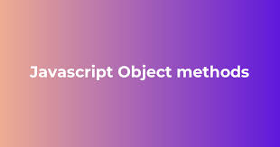
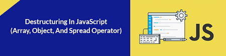

# Lecture 6
.png)
># _Table of content ;_ 
## _1.Object;_
## _2.Destructuring;_
## _3.Spread;_
## _4.This;_
## _5.New Date();_
># _What is Object in JS ?_ 
.jpg)
## _Object in iak obect dorroi iakchand value va key meboshad;In JavaScript, an object is a standalone entity, with properties and type. Everything is an object in JavaScript._
># _How to make an object_ : 
.png)
```
let obj = {
    name : "Bilol";
    Emai : @gmail.com,
    age : 22
}
console.log(obj) ---> output : { name : "Bilol"; Emai : @gmail.com,age 22}
```
## _3 Rohi giriftani value az object_
```
let obj = {                                     output
    name : "Bilol",
    "full name" : "Rahimov Bilol",
    Emai : @gmail.com,
    age : 22
}
console.log(obj.name);                         Bilol
console.log(obj["full name"]);                 Rahimov Bilol
va bo roho destructuring
```
># _Methods Of  Object :_

## _1.Object.entries()_ : - baroi nishon dodani key va valu - ho dar masivho 
```
let obj = {
    name : "Bilol",
    surName : "Rahimov",
    age : 12
}
console.log(Object.entries(obj));

output : [ [ 'name', 'Bilol' ], [ 'surName', 'Rahimov' ], [ 'age', 12 ] ]
```
## _1.Object.keys()_ : - baroi nishon dodani key (kluchho) - ho dar masiv
```
let obj = {
    name : "Bilol",
    surName : "Rahimov",
    age : 12
}
console.log(Object.keys(obj));

output : [ 'name', 'surName', 'age' ]
```
## _1.Object.values()_ : - baroi nishon dodani value (kimatho) - ho dar masiv
```
let obj = {
    name : "Bilol",
    surName : "Rahimov",
    age : 12
}
console.log(Object.values(obj));

output : [ 'Bilol', 'Rahimov', 12 ]
```
># _What is Object Destructuring and Spred;_

## _Destructuring object Milsli Array Desturucturing kor mrkunad ammo kavshoi object guzoshta meshavad Destrructuring in az object proprtihoro hamchun variable giriftan ammo az array kame tarzi giriftan fark mekunad_
```
let obj = {
    name : "Bilol",
    surName : "Rahimov",
    age : 12,
    city : {
        cityOf : "Kulob",
        village : "Ahmar"
    }
}
let {name} = obj                                   output:
console.log(name);                                 Bilol
let {name : a} = obj we can change the name of this
console.log(a);                                    Bilol
let {city : k} = obj
console.log(k);                      { cityOf: 'Kulob', village: 'Ahmar' }
let {city : { village : v }} = obj
console.log(v);                                     Ahmar
```
## _Spread inhma ba misli array kor mekunad spread dar object in propertihoro az objekt kopia karda mondan_
```
let obj = {
    name : "Bilol",
    surName : "Rahimov",
    age : 12,
}
let obj2 = {...obj}
console.log(obj2);

output : 
{ name: 'Bilol', surName: 'Rahimov', age: 12 }
```
# _What is this in js object : - this in fakat dar object kor mekunad dar  holalte ki mo dar iagon valuei properiti function menavisem this in dar returni function kor mekunad va obji blobalro mekobad_
```
let obj = {
    name : "Bilol",
    surName : "Rahimov",
    age : 12,
    fullName : function () {
        return `${this.surName} ${this.name}`
    }
}
console.log(obj.fullName());
output : 
Rahimov Bilol
```   